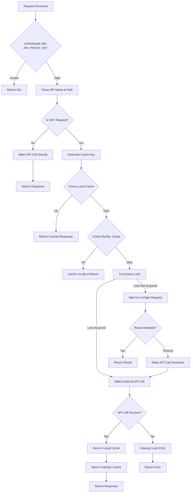
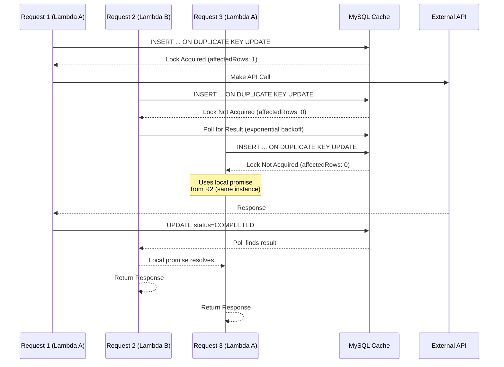

# API Proxy Process Documentation

## Overview

The API Proxy is a Lambda function that acts as a caching and deduplication layer for external API calls (primarily RapidAPI). It prevents duplicate API calls when multiple concurrent requests are made for the same resource, reducing costs and improving response times.

## Key Features

- **Request Deduplication**: Prevents multiple identical concurrent requests from making duplicate external API calls
- **Multi-Layer Caching**: In-memory cache (per Lambda instance) + MySQL cache (shared across instances)
- **Distributed Locking**: Uses MySQL row-level locking to coordinate across multiple Lambda instances
- **Graceful Degradation**: Falls back to direct API calls if MySQL is unavailable
- **Dummy Data Support**: Can return JSON from S3 for testing/development

## Architecture

```
┌─────────────┐
│ API Gateway │
└──────┬──────┘
       │
       ▼
┌─────────────────────────────────────────────────────────┐
│              Lambda Function (api-proxy)                  │
│                                                          │
│  ┌──────────────────────────────────────────────────┐  │
│  │         Request Handler (api-proxy.mjs)          │  │
│  │  - Authentication                                 │  │
│  │  - Routing                                        │  │
│  │  - Cache key generation                           │  │
│  └───────────────┬──────────────────────────────────┘  │
│                  │                                      │
│     ┌────────────┴────────────┐                        │
│     │                         │                         │
│     ▼                         ▼                         │
│  ┌──────────────┐      ┌──────────────┐               │
│  │ Local Cache  │      │ MySQL Cache  │               │
│  │ (in-memory)  │      │ (distributed) │               │
│  └──────────────┘      └──────┬───────┘               │
│                               │                        │
└───────────────────────────────┼──────────────────────┘
                                 │
                                 ▼
                          ┌──────────────┐
                          │   MySQL RDS  │
                          │  (api_proxy_ │
                          │    _cache)   │
                          └──────────────┘
                                 │
                                 │
                                 ▼
                          ┌──────────────┐
                          │  External    │
                          │  API (Rapid) │
                          └──────────────┘
```

## Process Flow

### GET Request Flow (with Deduplication)



### Lock Acquisition Process



## Components

### 1. Request Handler (`api-proxy.mjs`)

**Responsibilities:**
- Authentication using `API_PROXY_KEY`
- Request routing and URL building
- Cache key generation
- Orchestrating cache lookups and API calls
- Handling dummy data paths (S3 JSON responses)

**Key Functions:**
- `generateCacheKey()`: Creates MD5 hash from method, URL, and query params
- `buildTargetUrl()`: Constructs target API URL from path and query params
- `makeRequest()`: Makes HTTPS request to external API

### 2. Local Cache (`local-cache.mjs`)

**Responsibilities:**
- In-memory caching per Lambda instance
- LRU eviction when cache is full
- Memory usage tracking
- Local in-flight request deduplication

**Features:**
- TTL-based expiration
- Size limits (max entries, max memory)
- Access order tracking for LRU
- Local promise map for in-flight requests

**Configuration:**
- `MAX_CACHE_ENTRIES`: Default 50
- `MAX_CACHE_RESPONSE_SIZE`: Default 2MB
- `MAX_TOTAL_CACHE_MEMORY`: Default 30MB

### 3. MySQL Cache (`mysql-cache.mjs`)

**Responsibilities:**
- Distributed caching across Lambda instances
- Row-level locking for deduplication
- Polling with exponential backoff
- Connection pool management

**Key Functions:**
- `acquireCacheLock()`: Attempts to acquire lock using `INSERT ... ON DUPLICATE KEY UPDATE`
- `storeResultInMysql()`: Stores completed API response
- `getResultFromMysql()`: Retrieves cached response
- `waitForInFlightRequest()`: Polls MySQL for completed request
- `cleanupInFlightEntry()`: Removes failed in-flight entries

**Lock Mechanism:**
- Uses `INSERT ... ON DUPLICATE KEY UPDATE` for atomic lock acquisition
- Steals expired locks automatically
- Verifies lock ownership with `SELECT` query
- Includes retry logic for connection errors

## Caching Strategy

### Cache Key Generation

```javascript
cacheKey = MD5(method + baseUrl + JSON.stringify(queryParams))
```

**Example:**
- Method: `GET`
- Base URL: `https://bb-finance.p.rapidapi.com/v1/quote`
- Query Params: `{ symbol: "AAPL" }`
- Cache Key: `a1b2c3d4e5f6...` (MD5 hash)

### Cache Layers

1. **Local Cache (L1)**
   - Fastest access (in-memory)
   - Per Lambda instance
   - TTL: 30 seconds (configurable)
   - LRU eviction

2. **MySQL Cache (L2)**
   - Shared across all Lambda instances
   - TTL: 30 seconds (configurable)
   - Persists across Lambda invocations
   - Used for cross-instance deduplication

### Cache Lookup Order

```
1. Local Cache (L1)
   ↓ (miss)
2. MySQL Cache (L2)
   ↓ (miss)
3. Try Acquire Lock
   ├─ Lock Acquired → Make API Call
   └─ Lock Not Acquired → Wait for In-Flight Request
```

## Deduplication Mechanism

### Problem: Cache Stampede / Thundering Herd

When a cache expires, multiple concurrent requests can all see a cache miss and make duplicate API calls.

### Solution: Distributed Locking

1. **Lock Acquisition**
   - First request inserts row with `status=IN_FLIGHT`
   - Subsequent requests see existing row and wait
   - Uses `INSERT ... ON DUPLICATE KEY UPDATE` for atomicity

2. **Lock Verification**
   - After INSERT, verify ownership with `SELECT`
   - Checks `lock_token` matches and `expires_at` is valid
   - Prevents race conditions

3. **Waiting Strategy**
   - Local deduplication: Only one request per Lambda instance polls MySQL
   - Other requests in same instance wait on local promise
   - Exponential backoff: 200ms → 300ms → 450ms → ... (capped at 1s)
   - Initial delay: 500ms before first poll

4. **Result Distribution**
   - First request stores result in MySQL with `status=COMPLETED`
   - Waiting requests poll MySQL and find result
   - Result is cached locally for faster access

### Lock States

| Status | Description | Action |
|--------|-------------|--------|
| `IN_FLIGHT` | Request is being processed | Wait and poll |
| `COMPLETED` | Request completed successfully | Return cached result |
| Expired | Lock expired (stale) | Steal lock and retry |

## Error Handling

### MySQL Connection Errors

- **Retry Logic**: Single retry with 100-200ms delay for connection errors
- **Graceful Degradation**: Falls back to direct API calls if MySQL unavailable
- **Retryable Errors**: `ER_CON_COUNT_ERROR`, `ECONNREFUSED`, `ETIMEDOUT`, etc.

### API Call Failures

- **Cleanup**: Removes in-flight entry from MySQL
- **No Caching**: Failed responses are not cached
- **Error Propagation**: Returns error response to client

### Timeouts

- **Local Promise Timeout**: 6 seconds max wait for in-flight request
- **Polling Timeout**: 5 seconds max wait time
- **API Request Timeout**: 10 seconds

## Configuration

### Environment Variables

| Variable | Description | Default |
|----------|-------------|---------|
| `API_PROXY_KEY` | Authentication key for proxy | Required |
| `RAPID_API_KEY` | RapidAPI key | Required |
| `API_MAPPINGS` | API name to host mappings | Required |
| `API_PROXY_CACHE_TTL` | Cache TTL in seconds | 30 |
| `MYSQL_HOST` | MySQL host | Optional |
| `MYSQL_PORT` | MySQL port | 3306 |
| `MYSQL_USER` | MySQL user | Optional |
| `MYSQL_PASSWORD` | MySQL password | Optional |
| `MYSQL_DATABASE` | MySQL database | Optional |
| `API_KEYS_S3_BUCKET` | S3 bucket for API keys | Optional |
| `API_KEYS_DECRYPTED_S3_KEY` | S3 key for decrypted keys | `api-keys/decrypted-keys.json` |


## Database Schema

### `api_proxy_cache` Table

```sql
CREATE TABLE api_proxy_cache (
  cache_key VARCHAR(64) PRIMARY KEY,
  status INT NOT NULL DEFAULT 1,           -- 1=IN_FLIGHT, 2=COMPLETED
  response_data TEXT NULL,
  expires_at DATETIME NOT NULL,
  created_at DATETIME NOT NULL DEFAULT CURRENT_TIMESTAMP,
  locked_at DATETIME NULL,
  completed_at DATETIME NULL,
  lock_token VARCHAR(36) NULL,
  INDEX idx_expires_at (expires_at),
  INDEX idx_status (status)
) ENGINE=InnoDB DEFAULT CHARSET=utf8mb4;
```

## Performance Considerations

### Connection Pooling

- **Pool Size**: 1 connection per Lambda instance
- **Keep-Alive**: Enabled to reuse connections
- **Queue Limit**: 0 (fail fast if pool exhausted)

### Polling Optimization

- **Exponential Backoff**: Reduces database load
- **Jitter**: ±20% random variation to spread queries
- **Local Deduplication**: Only one poller per Lambda instance

### Memory Management

- **Cache Limits**: Prevents memory exhaustion
- **LRU Eviction**: Keeps frequently used items
- **Size Estimation**: Tracks memory usage per entry

## Monitoring & Debugging

### Key Log Messages

- `[MYSQL] Acquired lock for cache key: ...` - Lock successfully acquired
- `[MYSQL] Lock held by another request: ...` - Waiting for in-flight request
- `[MYSQL] Found result in MySQL after waiting for: ...` - Polling found result
- `[LOCAL] Becoming poller for: ...` - First waiter in Lambda instance
- `[LOCAL] Waiting on existing in-flight request for: ...` - Reusing local promise

### Metrics to Monitor

- Cache hit rate (local vs MySQL vs API calls)
- Lock acquisition success rate
- Average wait time for in-flight requests
- MySQL connection errors
- API call failures

